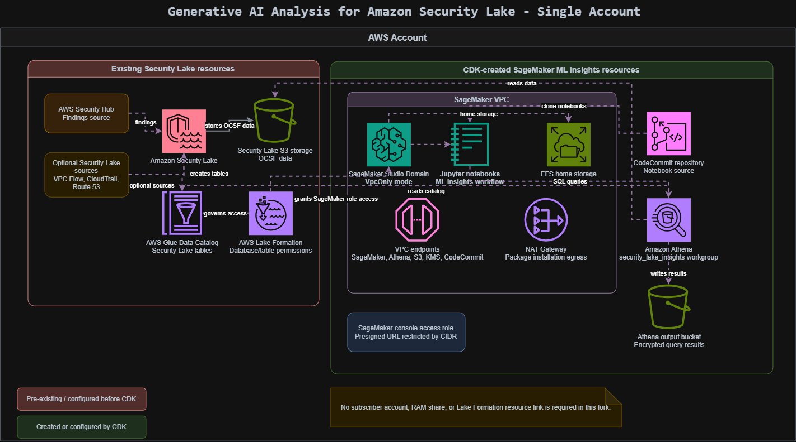

# SageMaker ML Insights for Amazon Security Lake

This repository is a modernized fork of the AWS sample [amazon-security-lake-machine-learning](https://github.com/aws-samples/amazon-security-lake-machine-learning). The original sample used a multi-account Security Lake subscriber architecture. This fork has been updated to deploy the SageMaker ML insights environment into a single AWS account.

The project deploys an [Amazon SageMaker Studio](https://aws.amazon.com/sagemaker/studio/) domain and supporting infrastructure for querying [Amazon Security Lake](https://aws.amazon.com/security-lake/) data with Athena. The included notebooks provide a starting point for time-series analysis, trend detection, outlier detection, and change-point detection against Security Hub findings stored in Security Lake.

For a detailed list of changes from the original AWS sample, see [MODERNIZATION_NOTES.md](MODERNIZATION_NOTES.md).

## What This Fork Changes

- Uses a single AWS account instead of a separate Security Lake account and SageMaker subscriber account.
- Removes the original Resource Access Manager and Lake Formation resource-linking workflow.
- Assumes Amazon Security Lake already exists in the same account.
- Grants the SageMaker execution role access to the configured Security Lake Glue database and table with Lake Formation, when enabled.
- Uses context values instead of hardcoded account-specific settings.
- Updates the notebooks and supporting Python code for modern Python environments, including Python 3.12.
- Adds Bedrock invoke permissions for the SageMaker user profile so later lab notebooks can use a modern Bedrock model or inference profile.

## Prerequisites

Before deploying this stack, complete these items in the same AWS account and region where you will deploy SageMaker:

1. Enable Amazon Security Lake.
2. Enable AWS Security Hub and ensure Security Hub findings are available as a Security Lake source.
3. Confirm that the Security Lake Glue database exists. The default expected database name is:

   ```text
   amazon_security_lake_glue_db_us_east_1
   ```

4. Confirm that the Security Hub findings table exists. The default expected table name is:

   ```text
   amazon_security_lake_table_us_east_1_sh_findings_2_0
   ```

5. Make sure the principal deploying the CDK stack has enough IAM, Glue, Lake Formation, SageMaker, CodeCommit, S3, KMS, Athena, EC2, and CloudFormation permissions.
6. If `createLakeFormationPermissions` is set to `true`, the deploying principal must be allowed to grant Lake Formation permissions on the Security Lake database and table.

This CDK stack does not create Security Lake, Security Hub, or the Security Lake source tables.

## Solution Architecture



1. Security Lake, Glue, Lake Formation, Athena, SageMaker, CodeCommit, and the Athena output bucket live in the same AWS account.
2. Security Lake writes normalized OCSF data into S3 and exposes it through Glue tables.
3. Lake Formation controls access to the Security Lake database and tables.
4. SageMaker Studio runs in `VpcOnly` mode inside a dedicated VPC.
5. SageMaker notebooks use Athena to query the configured Security Lake Glue table.
6. A CodeCommit repository is created and populated with the notebooks.
7. An Athena workgroup and encrypted S3 results bucket are created for notebook queries.
8. Optional Lake Formation grants can be created by CDK for the SageMaker user profile role.


## Configure CDK Context

Create `source/cdk.context.json` before deploying. Do not commit a personal context file with real account IDs, principal ARNs, or cached CDK lookups.

Example:

```json
{
  "sagemakerRestrictCidrPresignedUrl": "YOUR_PUBLIC_IP/32",
  "sagemakerPresignedUrlTrustedPrincipalArn": "arn:aws:iam::<account-id>:user/<your-iam-user>",
  "cloudWatchVpcFlowLogsLogGroupName": "/aws/vpc/flowlogs/SageMakerDomainStack",
  "securityLakeDatabaseName": "amazon_security_lake_glue_db_us_east_1",
  "securityLakeTableName": "amazon_security_lake_table_us_east_1_sh_findings_2_0",
  "athenaWorkgroupName": "security_lake_insights",
  "bedrockModelId": "us.anthropic.claude-sonnet-4-6",
  "createLakeFormationPermissions": true
}
```

Context values:

- `sagemakerRestrictCidrPresignedUrl`: CIDR allowed to create SageMaker Studio presigned URLs.
- `sagemakerPresignedUrlTrustedPrincipalArn`: IAM principal that can assume the SageMaker console presigned URL role.
- `cloudWatchVpcFlowLogsLogGroupName`: CloudWatch log group for VPC flow logs.
- `securityLakeDatabaseName`: Existing Security Lake Glue database name.
- `securityLakeTableName`: Existing Security Lake table used by the notebooks.
- `athenaWorkgroupName`: Athena workgroup created for notebook queries.
- `bedrockModelId`: Bedrock model ID, inference profile ID, or model ARN used by later notebooks.
- `createLakeFormationPermissions`: Set to `true` to let CDK grant the SageMaker role database/table permissions. Set to `false` if you prefer to manage Lake Formation permissions manually.

## Deploy SageMaker Studio with CDK

Run these commands from the CDK project folder:

```powershell
cd source
npm install
npm run build
```

Bootstrap your account and region if needed:

```powershell
npx cdk bootstrap aws://<account-id>/<region>
```

Deploy the stack:

```powershell
npx cdk deploy SageMakerDomainStack
```

The stack output includes the CodeCommit repository URL:

```text
sagemakernotebookmlinsightsrepositoryURL
```

Use that URL from SageMaker Studio or a local terminal to clone the notebook repository.

## What the Stack Creates

- SageMaker Studio domain in `VpcOnly` mode.
- SageMaker user profile and execution role.
- IAM role for restricted SageMaker Studio presigned URL access.
- VPC, private workload subnets, NAT egress, security group rules, and VPC endpoints.
- CodeCommit repository containing the notebooks.
- Athena workgroup for Security Lake ML insights.
- Encrypted S3 bucket for Athena query results.
- KMS keys for SageMaker and Athena result storage.
- Optional Lake Formation permissions for the configured Security Lake database/table.

## What the Stack Does Not Create

- Amazon Security Lake.
- AWS Security Hub.
- Security Lake source configuration.
- Security Lake Glue database or tables.
- Cross-account RAM resource shares.
- Lake Formation resource links.

## Post-Deployment Steps

### 1. Open SageMaker Studio

Open the deployed SageMaker Studio domain and create or open a Jupyter experience. The SageMaker UI has changed since the original AWS blog, so the exact labels may differ. A JupyterLab or Code Editor space with a Python 3 kernel is suitable.

### 2. Clone the Notebook Repository

You can clone the CodeCommit repository from a SageMaker terminal:

```bash
git clone <sagemakernotebookmlinsightsrepositoryURL>
```

If CodeCommit prompts for credentials, use the normal AWS CodeCommit credential helper or clone from a terminal that already has AWS credentials available.

### 3. Verify Lake Formation Access

If `createLakeFormationPermissions` was `true`, CDK attempts to grant the SageMaker role:

- `DESCRIBE` on the configured Security Lake database.
- `DESCRIBE` and `SELECT` on the configured Security Lake table.

If you disabled CDK-managed grants, manually grant those Lake Formation permissions to:

```text
arn:aws:iam::<account-id>:role/sagemaker-user-profile-for-security-lake
```

### 4. Run the Notebooks

Start with:

```text
source/notebooks/tsat/0.0-tsat-environ-setup.ipynb
source/notebooks/tsat/0.1-load-data.ipynb
```

Then run the analysis notebooks:

```text
source/notebooks/tsat/1.1-trend-detector.ipynb
source/notebooks/tsat/1.2-outlier-detection.ipynb
source/notebooks/tsat/1.3-changepoint-detector.ipynb
```

The notebook text still includes some original lab wording. Some library references were kept for historical context, even though the implementation has been modernized to avoid outdated dependencies where needed.

## Notebook Summary

### Environment Setup

[0.0-tsat-environ-setup.ipynb](source/notebooks/tsat/0.0-tsat-environ-setup.ipynb)

Installs the required Python libraries for the notebook workflow.

### Load Data

[0.1-load-data.ipynb](source/notebooks/tsat/0.1-load-data.ipynb)

Connects to Athena, queries Security Lake data, and creates time-series datasets. The default query targets Security Hub findings, but you can adapt it to other Security Lake tables by updating the configured table and SQL fields.

### Trend Detector

[1.1-trend-detector.ipynb](source/notebooks/tsat/1.1-trend-detector.ipynb)

Identifies positive and negative trends in grouped time-series data.

### Outlier Detection

[1.2-outlier-detection.ipynb](source/notebooks/tsat/1.2-outlier-detection.ipynb)

Uses decomposition and residual analysis to find unusual data points.

### Change-Point Detection

[1.3-changepoint-detector.ipynb](source/notebooks/tsat/1.3-changepoint-detector.ipynb)

Detects sustained changes in a time series, such as shifts in count or mean level.

## Troubleshooting

### Lake Formation Permission Errors

If Athena reports that the requester is not authorized or that Glue resources cannot be accessed, verify:

- The Security Lake database and table names match your account.
- The SageMaker role has Lake Formation `DESCRIBE` and `SELECT` permissions.
- The deploying principal had permission to create `AWS::LakeFormation::PrincipalPermissions`.

### Schema Mismatches

Security Lake table schemas can vary by source and OCSF version. If a notebook query fails with `COLUMN_NOT_FOUND`, inspect the Glue table schema and update the SQL fields accordingly. The modernized notebooks were tested against Security Lake v2-style table names such as:

```text
amazon_security_lake_table_us_east_1_sh_findings_2_0
```

### SageMaker UI Differences

The original blog screenshots may reference older SageMaker Studio navigation. In the current UI, use JupyterLab or Code Editor spaces and clone the notebook repository from a terminal when the Git sidebar workflow is unavailable.

## Security

See [CONTRIBUTING](CONTRIBUTING.md#security-issue-notifications) for more information.

## License

This library is licensed under the MIT-0 License. See the [LICENSE](LICENSE) file.
